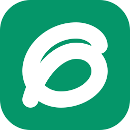

<p align="center">
  
</p>

<h1 align="center">Minerva OS Reach Lite</h1>

<p align="center">
  <strong>Plateforme de prospection IA, CRM et gestion d'équipe pour agences locales</strong>
</p>

<p align="center">
  Application de bureau et web basée sur Next.js 15, Supabase, Electron et Capacitor. Prospection géolocalisée, CRM leads, chat d'équipe temps réel, agents IA, bibliothèque de contenu et analytics — déployable à 100% gratuitement.
</p>

<div align="center">

[](https://github.com/Ensieg/minerva-os-lite-desktop/releases)
[](https://nodejs.org/)
[](https://pnpm.io/)
[](https://nextjs.org/)
[](https://supabase.com/)
[](https://www.electronjs.org/)

</div>

---

## Table des matières

- [Présentation](#présentation)
- [Fonctionnalités v2.21.0](#fonctionnalités-v2210)
- [Sécurité](#sécurité)
- [Architecture](#architecture)
- [Prérequis et configuration](#prérequis-et-configuration)
- [Développement local](#développement-local)
- [Déploiement](#déploiement)
- [Feuille de route](#feuille-de-route)

---

## Présentation

Minerva OS Reach Lite aide les agences et professionnels du web à identifier des commerces locaux avec des lacunes en ligne, les contacter par IA, suivre les deals dans un CRM et collaborer en équipe — tout ça depuis une seule interface.

Trois modes d'exécution, même codebase :
- **Web** — déployé sur Vercel, API routes côté serveur
- **Desktop Electron** — export statique Next.js, base SQLite locale avec sync bidirectionnelle vers Supabase
- **Mobile Capacitor** — iOS et Android (prochainement disponible en App Store / Play Store)

---

## Fonctionnalités v2.21.0

### Prospection & Leads
- Recherche géolocalisée multicritère (Google Maps via OSM Nominatim, Yelp, PagesJaunes)
- Carte interactive des leads par zone
- Score de lead persisté en base de données
- CRM complet : statut, priorité, notes, date de prochaine action, assignation à un membre d'équipe
- Page de détail dédiée par lead (site, note Google, photos, réseaux sociaux)
- Enrichissement automatique optionnel via Apify
- Audit SEO instantané (HTTPS, mobile, meta tags, vitesse, tracking)
- Pipeline Kanban + vue tableau (TanStack Table)

### IA & Chat
- Chat IA avec streaming (cascade de fournisseurs : Groq → Together.ai → OpenRouter → Anthropic)
- Génération de brouillons d'emails de prospection personnalisés par lead
- Marketplace d'agents IA personnalisés avec espace de travail dédié
- Page Intelligence : synthèses et recommandations IA sur le portefeuille de leads

### Équipe & Collaboration
- Chat d'équipe temps réel (Supabase Realtime)
- Avatars de profil dans les bulles de chat
- Mentions @membre avec autocomplete
- Invitations par email (API Admin Supabase côté serveur)
- Rôles configurables : Administrateur, Éditeur, Lecteur
- Système de notifications temps réel (cloche + Realtime)
- Cron Vercel pour rappels de tâches en retard et digest quotidien

### Bibliothèque & Contenu
- Éditeur de texte enrichi TipTap (gras, italique, titres, listes, code)
- Partage de documents avec lien copiable
- Assignation de documents à des projets (sidebar)

### Analytics
- Métriques réelles (leads créés, tâches complétées, messages envoyés)
- Heatmap d'activité quotidienne style GitHub (8starlabs, 12 mois)
- Graphiques de tendances sur 30 jours

### Paramètres & Personnalisation
- Navigation par sections groupées style Langdock (Compte / Espace de travail / Utilisateurs / Outils)
- Profil avec avatar (base64), bio, rôle
- Clés API IA (OpenRouter, Groq, Together.ai) — masquées end-to-end, jamais exposées au client
- Configuration SMTP pour envoi email sans Gmail
- Thème clair / sombre / système
- i18n : Français, English, Deutsch
- Densité d'affichage : confortable / compact

### Get Started (Onboarding)
- 8 tâches en français avec navigation automatique vers la bonne page au clic
- Barre de progression temps réel
- Système de points gamifié (XP par tâche complétée)

### Desktop Electron
- Base SQLite locale avec sync bidirectionnelle Last-Write-Wins (toutes les 5 min + on-demand)
- Spotlight Search global (`Option+Space` / `Alt+Space`)
- Popover barre système (tray) avec vue tâches du jour
- Scraping de fond automatique toutes les 6 heures
- Export PDF natif

---

## Sécurité

- **Clés API IA masquées end-to-end** : les clés OpenRouter, Groq, Together.ai saisies par l'utilisateur ne sont jamais retournées en clair au navigateur ni mises en cache dans `localStorage`. Elles sont stockées chiffrées côté Supabase et gérées exclusivement via des route handlers serveur.
- **`SUPABASE_SERVICE_ROLE_KEY` serveur uniquement** : jamais exposée au bundle client. Utilisée uniquement dans les route handlers (invitations, gestion des rôles).
- **RLS Supabase** : toutes les tables (`leads`, `tasks`, `notes`, `settings`, `workspaces`, `team_messages`, `notifications`) protégées par Row Level Security. Un utilisateur ne peut lire/écrire que les données des workspaces dont il est membre.
- **Routes d'administration durcies** : `app/api/team/*` valide l'appartenance au workspace avant toute mutation, en plus du RLS.
- **Auth** : connexion par mot de passe ou OTP passwordless, réinitialisation via flux PKCE sécurisé.
- **IPC Electron** : canal `dbRun/dbAll/dbGet` paramétré (pas de concaténation SQL), confiné à la machine locale.

---

## Architecture

### Contextes d'exécution

```
Web (Vercel)          → API routes Next.js côté serveur
Electron (Desktop)    → Export statique out/, SQLite local, IPC, sync vers Supabase
Capacitor (Mobile)    → Même export statique, APIs natives (caméra, push, prefs)
```

### Dual-Store Pattern

Toutes les mutations dans `ReachContext` suivent ce pattern :

```typescript
if (window.electron) {
  // SQLite via IPC → sync_status: 'pending_insert' → triggerSync()
} else {
  // Supabase createClient() directement
}
```

### Structure des routes

```
app/
  (app)/           ← Shell authentifié (sidebar + topbar + ReachProvider)
    today/         ← Dashboard du jour
    leads/         ← CRM + [id] détail + pipeline Kanban
    prospecting/   ← Scraping géolocalisé + carte
    chat/          ← Chat IA streaming
    agents/        ← Marketplace agents IA
    intelligence/  ← Synthèses IA
    analytics/     ← Dashboard + heatmap
    team/          ← Membres + chat temps réel
    library/       ← Bibliothèque + éditeur TipTap
    settings/      ← Paramètres groupés style Langdock
    workspaces/    ← CRUD workspaces
    integrations/  ← Connecteurs tiers
  api/
    chat/          ← Streaming IA (cascade Groq→Together→OpenRouter→Anthropic)
    generate-draft/← Génération email prospection
    scrape-maps/   ← Scraping Google Maps / OSM
    send-email/    ← Envoi Gmail OAuth
    export-drive/  ← Export Google Drive
    team/          ← Invitations + membres + rôles (service_role)
    cron/          ← Rappels tâches en retard (Vercel Cron)
  login/           ← Auth OTP + mot de passe + inscription
  onboarding/      ← Multi-étapes avec animations
```

### État global : ReachContext

`lib/reach-context.tsx` — provider central wrappant tout le shell `(app)`. Contient : `leads`, `tasks`, `aiSuggestions`, `quickNote`, `focusItems`, `workspacesList`, `activeWorkspace`.

Partitionnement par workspace : toutes les queries incluent `workspace_id = activeWorkspace.id`.

---

## Prérequis et configuration

### Prérequis système
- Node.js ≥ 20
- pnpm ≥ 9

### Variables d'environnement

Créez `.env.local` à la racine du projet :

```env
NEXT_PUBLIC_SUPABASE_URL=https://votre-projet.supabase.co
NEXT_PUBLIC_SUPABASE_ANON_KEY=votre-cle-anon
SUPABASE_SERVICE_ROLE_KEY=votre-cle-service-role   # serveur uniquement

GOOGLE_CLIENT_ID=votre-client-id.apps.googleusercontent.com
GOOGLE_CLIENT_SECRET=votre-client-secret

ANTHROPIC_API_KEY=votre-cle-anthropic

NEXT_PUBLIC_APP_URL=https://votre-domaine.com   # utilisé par Electron/Capacitor
```

---

## Développement local

```bash
# Installer les dépendances
pnpm install

# Serveur web Next.js
pnpm dev                  # http://localhost:3000

# Electron (après pnpm dev)
pnpm electron:dev

# Vérifications
pnpm typecheck            # TypeScript (zero erreurs requis)
pnpm lint                 # ESLint
pnpm format               # Prettier
```

---

## Déploiement

Voir **[DEPLOYMENT.md](./DEPLOYMENT.md)** pour le guide complet (Supabase schema, Vercel, Google OAuth, domaine Cloudflare, Electron build, cron jobs) — **100% gratuit** pour une petite équipe.

Résumé rapide :
1. Créer un projet Supabase → exécuter le schema SQL → activer Realtime sur `team_messages` et `notifications`
2. Importer le repo sur Vercel → configurer les variables d'environnement → déployer
3. Mettre à jour les URLs dans Supabase Auth → Site URL + Redirect URLs

---

## Feuille de route

### Planifié (non implémenté, voir planning interne)

- **Leaderboard d'équipe** — classement gamifié basé sur le score de leads et les tâches complétées (système de points XP déjà en place, agrégation inter-membres manquante)
- **Planification d'itinéraires** — optimisation de tournées de prospection sur la carte (Google Maps Directions API ou OSRM open-source)
- **Scraping Apify avancé** — source d'enrichissement Apify Google Maps Scraper avec polling asynchrone du dataset
- **Filtres prospection avancés** — rayon, note minimum, "ouvert maintenant", niveau de prix, exclusion leads déjà en CRM
- **Persistance du chat IA en base** — remplacement du stockage localStorage actuel par des tables `chat_threads` / `chat_messages` (Supabase + SQLite)
- **Mascotte arbre animée** — SVG animé dans le chat selon l'état (idle / réflexion / écriture / recherche web)
- **Services / catalogue d'offres** — table `services` avec CRUD, utilisable depuis la page de détail d'un lead ("Présenter une offre")
- **Rich text images dans l'éditeur** — TipTap Image extension pour insertion d'images dans les documents de bibliothèque
- **iOS / Android** — publication App Store et Play Store (Capacitor build prêt, comptes développeur requis)

---

## Fichiers clés de référence

| Fichier | Rôle |
|---|---|
| `lib/reach-context.tsx` | État global, dual-store, mappers DB→UI |
| `electron/database.cjs` | Schéma SQLite, `initDb()` |
| `electron/sync.cjs` | Moteur de sync Last-Write-Wins |
| `electron/main.cjs` | Windows Electron, IPC handlers |
| `lib/translations.ts` | Toutes les clés i18n (fr/en/de) |
| `app/(app)/layout.tsx` | Shell, sidebar, topbar |
| `middleware.ts` | Auth guard + redirect onboarding |
| `DESIGN.md` | Système de design complet |
| `DEPLOYMENT.md` | Guide de déploiement gratuit |
